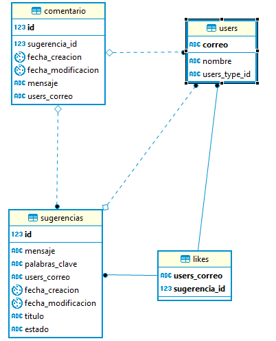
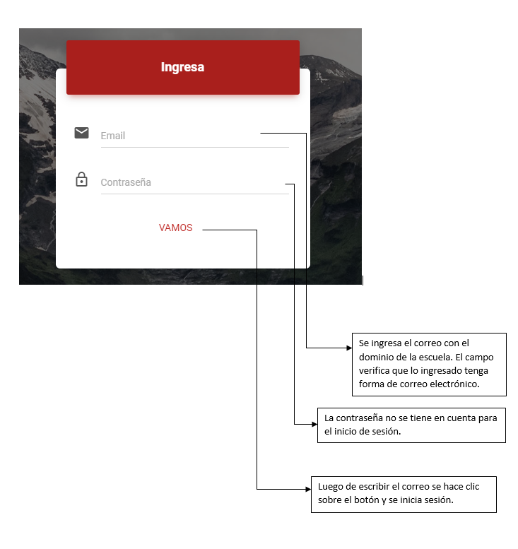
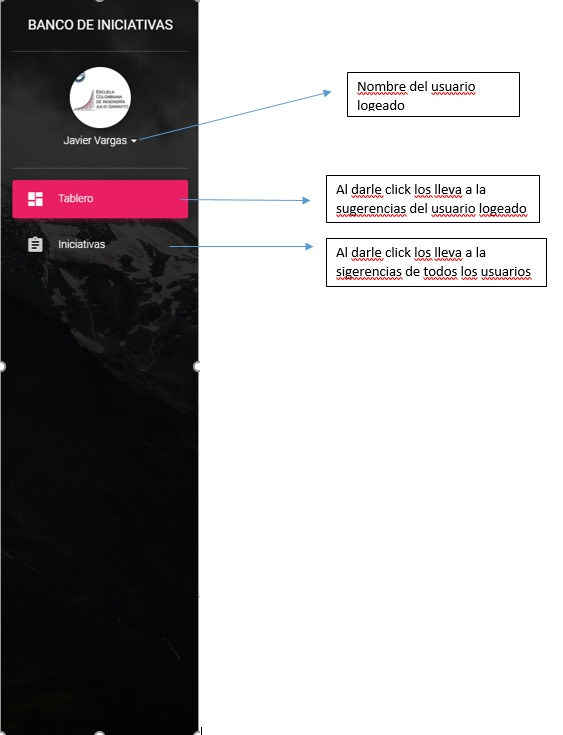

# BancoDeIniciativas
Banco de iniciativas de la Oficina de Proyectos de la ECI

Proyecto implementado por:

 - Javier Vargas
 - Sebastian Goenaga
 - David Ramirez
 - Daniel Vela

Para la materia de Procesos de Desarrollo de Software en el periodo académico del 2018-2, con el profesor Santiago Alzate como Product Owner.

## Visión del producto

La **Plataforma banco de iniciativas de proyectos**, es una herramienta donde la comunidad universitaria de la Escuela Colombiana de Ingeniería Julio Garavito pueden registrar sus iniciativas e ideas de proyectos para ser desarrollados o gestionados por la PMO de la Escuela. El sistema, más allá de facilitar el registro de las iniciativas e ideas de proyectos, es una valiosa base de conocimiento donde los diferentes actores pueden revisar si hay iniciativas, ideas o intereses similares y aunar esfuerzos para la materialización. Adicional a lo anterior, el personal académico puede integrar a los estudiantes de diferentes asignaturas o proyectos de grado para su realización, materializando las iniciativas para el beneficio de toda la comunidad universitaria. La PMO puede priorizar las iniciativas viables, asignar responsables, gestionar la asignación de recursos, llevar métricas e identificar grupos de interés -a través del tiempo- que se van presentando para cada iniciativa. Con esto se espera lograr no solo la realización de los proyectos sino una aplicación práctica de los conocimientos adquiridos por los estudiantes dentro de las asignaturas de la Escuela generando un ambiente de aprendizaje colaborativo.

### Detales provistos por el _Stakeholder_

El objetivo del sistema es permitir el registro y seguimiento de las iniciativas e ideas de proyectos que han sido propuestas por la comunidad universitaria de la Escuela. El banco de iniciativas debe contar con una interfaz de usuario bonita y amigable con los usuarios.

#### Tipos de usuario

* Administrador
* Personal PMO - ODI
* Proponente de iniciativa o idea de proyecto
* Usuarios de consulta

#### Permisos

##### Administrador

* Modificar el Estado de las ideas o iniciativas.
* Agrupamiento de las ideas o iniciativas equivalentes o relacionadas

##### Personal PMO - ODI

* Consultar las iniciativas o ideas de proyectos que los proponentes han publicado.
* Cambiar el estado de las iniciativas

##### Proponente:

* Registrar de una iniciativa o idea: Importante guardar la referencia a los datos del usuario para poder ser contactados, incluyendo su área o dependencia.
* Consultar las ideas o iniciativas que el proponente ha realizado
* Modificar una iniciativa o idea siempre y cuando se encuentre en el estado “propuesta”.

##### Público

* Consultar la información de las diferentes ideas o iniciativas 
* Poder mostrar su interés o afinidad con el desarrollo de una idea o iniciativa de proyecto que se encuentre en el banco y dejar comentarios u observaciones al mismo. 
* Votar (dar like) sobre una idea o iniciativa.
* Indicar la intención de trabajar o apoyar el desarrollo de la iniciativa o idea de proyecto, es decir, que le interesa
* Consultar las ideas o iniciativas de acuerdo a palabras clave
* Entregar estadísticas con base en la información registrada.

##  Diseño y Arquitectura

### Modelo E-R

### Diagrama de Clases

### Stack de tecnologías

#### MyBatis

MyBatis es un framework de persistencia que soporta SQL, procedimientos almacenados y mapeos avanzados. 

#### PrimeFaces

PrimeFaces es un framework visual open source para JavaServer Faces que incluye más de 100 componentes.

#### Bootstrap

Bootstrap es un kit de herramientas open source para desarrollo con HTML, CSS y JavaScript.

#### Guice

Guice es un framework ligero de inyección de dependencias para Java 6 en adelante creado por Google.

#### PostgreSQL

PostgreSQL es una base de datos relacional open source que usa y extiende el lenguaje SQL combinado con otras características que almacenan y escalan cargas de datos pesadas.

##  Manual de usuario

### Pantalla de login:

### Navbar:

